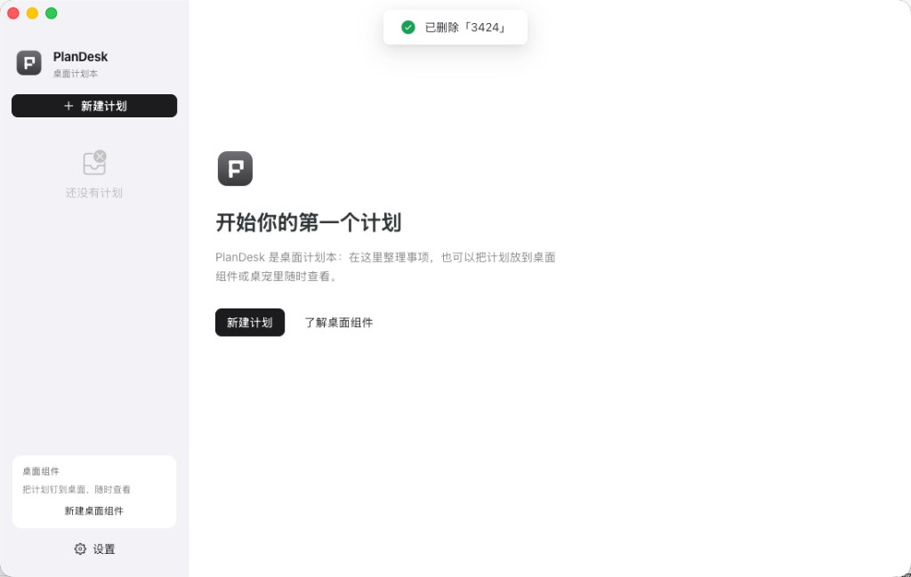
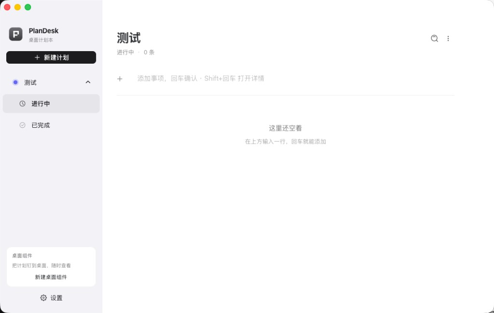
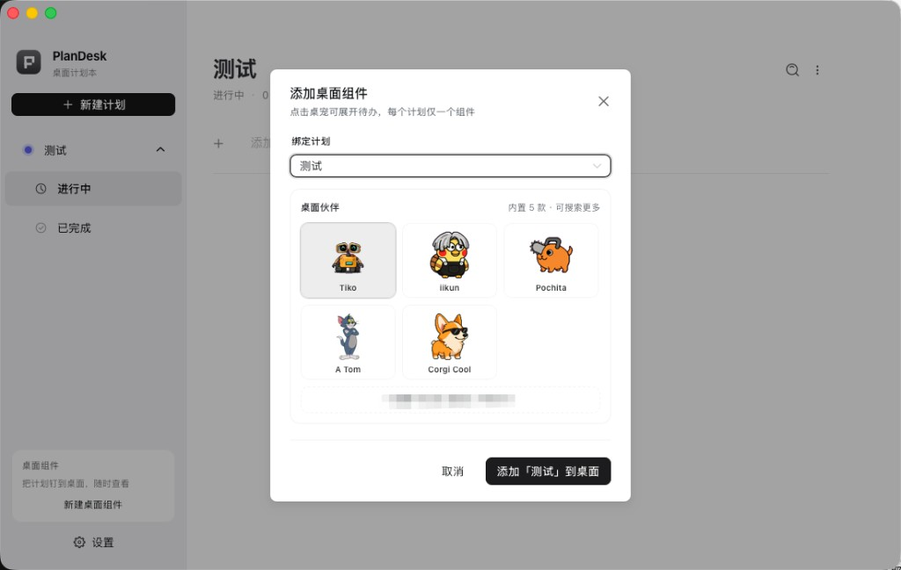

# PlanDesk

轻量桌面计划本，支持计划分组、事项管理、桌面浮动小组件。支持 **macOS** 与 **Windows**。

**当前版本：[1.4.6](CHANGELOG.md)**

## 界面预览

<p align="center">
  
</p>
<p align="center"><sub>欢迎页 — 开始你的第一个计划</sub></p>

<p align="center">
  
</p>
<p align="center"><sub>计划管理 — 侧边栏树形导航与事项录入</sub></p>

<p align="center">
  
</p>
<p align="center"><sub>桌面组件 — 绑定计划并选择桌宠伙伴</sub></p>

## 功能

- **计划管理**：创建、重命名、删除计划；侧边栏树形导航（进行中 / 已完成）
- **事项录入**：标题 + 备注 + 置顶；内联编辑标题；拖拽排序
- **关联文件（可选）**：编辑事项时可关联本地文件或文件夹；列表中点击标签打开；右键可「在 Finder / 资源管理器中显示」
- **跨计划移动**：编辑弹窗或右键菜单将事项移动到其他计划
- **搜索**：`⌘K` / `Ctrl+K` 全局搜索标题与备注
- **完成撤销**：勾选完成后 3 秒内可撤销
- **桌面组件**：浮动透明窗口，按计划显示进行中事项；每个计划只能创建一个组件
  - **列表模式**：传统待办面板
  - **宠物模式**（像素风 spritesheet）：Canvas 帧动画 + 8 方向看向鼠标，点击展开列表
- **全局快速添加**：`Alt+Space`（macOS）/ `Alt+Shift+Space`（Windows）弹出独立小窗，无需主窗口在前台
- **系统托盘 / 菜单栏**：关闭主窗口后仍在后台运行
  - **macOS 菜单栏**：左键弹出菜单，顶部显示进行中数量，列出最近事项（`[计划名] 标题`）；点击即可标记完成
  - **Windows 托盘**：右键菜单预览最近事项
- **仅菜单栏模式**（macOS）：可隐藏 Dock 图标，只从顶部菜单栏访问
- **数据备份**：设置页导出/导入 JSON，导入前自动备份 `store.json.bak`
- **开机自启**：设置页可选开关

## 开发

需要 [Node.js](https://nodejs.org/) 与 [Rust](https://www.rust-lang.org/tools/install)。

```bash
cd plan-desk
npm install
npm run dev
```

`postinstall` 会自动生成应用图标与菜单栏 Tray 图标。

## 打包

### macOS

```bash
npm run dist:mac
```

输出：`src-tauri/target/release/bundle/macos/PlanDesk_*.dmg`

### Windows

在 Windows 电脑上：

```bash
npm run dist:win
```

输出：`src-tauri/target/release/bundle/nsis/` 或 `msi/` 下的安装包。

> 在 macOS 上交叉编译 Windows 安装包较麻烦，推荐在 Windows 机器或 GitHub Actions 上构建。

## 快捷键

| 操作 | macOS | Windows |
|------|-------|---------|
| 全局搜索 | `⌘K` | `Ctrl+K` |
| 聚焦快速录入 | `⌘N` | `Ctrl+N` |
| 全局快速添加 | `Alt+Space` | `Alt+Shift+Space` |
| 新建桌面组件 | `⌘+Shift+W` | `Ctrl+Shift+W` |
| 列表上下选择 | `↑` / `↓` | `↑` / `↓` |
| 切换完成 | `Enter` | `Enter` |
| 删除选中事项 | `Delete` / `Backspace` | `Delete` / `Backspace` |
| 关闭弹窗 | `Esc` | `Esc` |

## 数据存储

| 平台 | 路径 |
|------|------|
| macOS | `~/Library/Application Support/com.qiyuan.plandesk/store.json` |
| Windows | `%APPDATA%\com.qiyuan.plandesk\store.json` |

从 Electron 版升级时会自动从旧路径（`plan-desk/store.json`）复制数据。

可在设置页导出 JSON 备份，或打开数据目录手动复制 `store.json`。

## macOS 使用说明

1. 关闭主窗口不会退出应用；可从 **Dock** 或 **顶部菜单栏图标** 重新打开
2. 点击菜单栏图标弹出菜单：顶部显示进行中数量，列出最近事项（`[计划名] 标题`），点击即可标记完成
3. 悬停菜单栏图标可看到进行中数量提示
4. 设置 →「仅保留菜单栏」可隐藏 Dock，变成纯菜单栏应用
5. 桌面组件不会出现在 Dock / ⌘+Tab 切换中
6. `Alt+Space` 弹出快速添加小窗，失焦自动隐藏
7. 编辑事项 →「关联文件」→ 添加文件/文件夹；左键打开，文件夹按钮可在 Finder 中显示；路径失效时可重新选择

## Windows 使用说明

1. 安装后从开始菜单或桌面快捷方式启动
2. 关闭主窗口不会退出应用，图标仍在系统托盘
3. 右键托盘图标 →「退出」完全关闭
4. `Alt+Shift+Space` 弹出快速添加小窗
5. 编辑事项可关联文件/文件夹；右键标签可打开或在资源管理器中显示

## 更新记录

详见 [CHANGELOG.md](CHANGELOG.md)。

## 技术栈

- Tauri 2 + Vue 3 + Naive UI
- 图标：[IconPark](https://iconpark.oceanengine.com/official)（`@icon-park/vue-next`）

## 许可证

[MIT](LICENSE)
